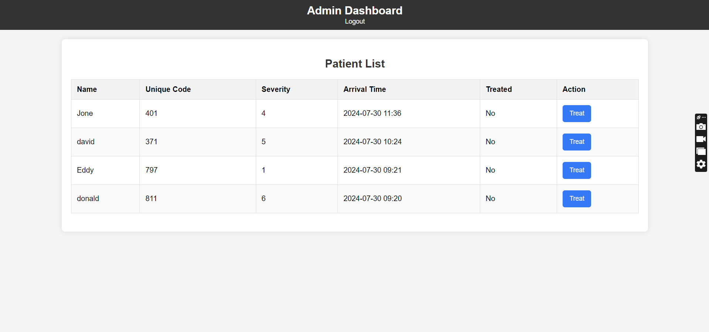
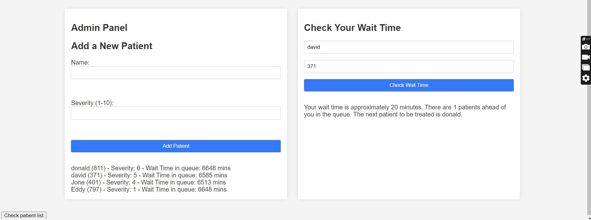
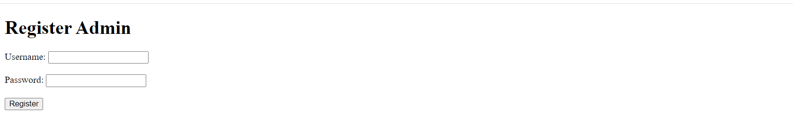

How To Run:
1. Clone the repository
2. Download all the dependencies
3. Setup server + db
4. Run the server
5. Open the browser and go to localhost:3000

Features:
- Admin's can register and login
- Users can login/logout
- Admin has separate view of dashboard

User Perspective:
- User can login 
- Provide the 3-letter code to view approximate wait time

Admin Perspective:
- Admin can register and login
- View admin panel with patient info including name, code, severity, and wait times
- Manually update wait times for patients

Pictures:
- 
- 
- 